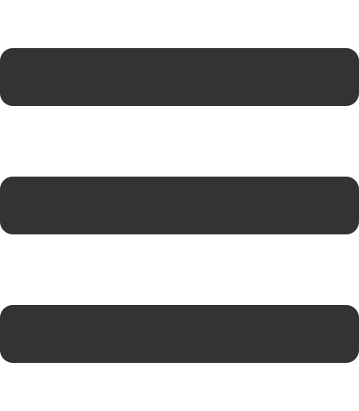

<!-- Top Links -->

[Requirements](#reqs) | [HTML](#html) | [CSS](#css) | [JavaScript](#js) | [SCORM](#scorm) | [Production](#production)

# <a id="reqs"></a> 1. Requirements

- An IDE/text editor: _Recommended:_ <a href="https://code.visualstudio.com/" target="_blank">Visual Studio Code</a>
- An SCSS/SASS compiler - _Recommended:_ <a href="https://marketplace.visualstudio.com/items?itemName=ritwickdey.live-sass" target="_blank">Live Sass Compiler for VS Code</a>

- A development server: _Recommended:_ <a href="https://marketplace.visualstudio.com/items?itemName=ritwickdey.LiveServer" target="_blank">Live Server for VS Code</a> - _This comes with the the Live Sass Compiler_

- A Minifying addon: _Recommended:_ <a href="https://marketplace.visualstudio.com/items?itemName=olback.es6-css-minify" target="_blank">JS & CSS Minifier (Minify) </a>

# <a id="html"></a> 2. Basic Structure (HTML)

[Header](#header) | [Slider](#slider) | [Slides](#slides)

The demonstrated markup below is already included within the template. This is to provide basic understanding of the structure and layout.

## <a id="header"></a> Header

This is the top navigation bar. The button with the id of `menu-toggle` toggles the slide-out navigation. Change the title and subtitle here as needed, but leave the ids intact.

Once the course has began, the user's name and initials will be placed to the far right, next to the navIcon. The courseSubtitle will be replaced with the situation once the course begins.

```
<header>

    <button id="menu-toggle" class="ma-1" onclick="toggleClass('menu','hidden');">
        
    </button>

    <div id="courseTitle">
        COURSE TITLE <span id="courseSubtitle">| COURSE SUBTITLE </span>
    </div>

    <div class="header-right">
        <span id="studentName"></span>
        <span id="studentInitials"></span>
        
    </div>

</header>
```

## <a id="slider"></a> Slider

This element wraps all of the course's content. It should always have the id of `slider` and should **ONLY** have direct child elements with the class of `slide`.

```
<main id="slider">
    // All slides go here
</main>
```

## <a id="slides"></a> Slides

These elements contain your course's content. They **MUST** have the class of `slide` or they will **NOT** be loaded. The first slide in the course should have the class `active`. This class controls what slide to show, and is transferred around during navigation. It should **ONLY** be on one element, or multiple slides will show at once.

The first slide for a situation should always have an id of `situation#` ( _# being the current situation's number_ ). If the situation contains more than one slide, the last slide should have the id of `situation#end`. The current situation will replace the course's subtitle once the course has begun.

```
<header>
    // All of the header content
</header>

<main id="slider">
    <section class="slide active" id="splash">
        // Landing Page
    </section>

    <section class="slide" id="intro">
        // Intro info and prepareData() button here
    </section>

    <section class="slide" id="situation1">
        // Situation 1 exercise A
    </section>

    <section class="slide" id="situation1end">
        // Situation 1 exercise B
    </section>

    <section class="slide" id="situation2">
        // Situation 2 exercise A
    </section>
</main>
```

# <a id="css"></a>3. Styling (CSS)

[Theme](#theme) | [Bootstrap](#bootstrap) | [AnimateCSS](#animate) |

This template uses SCSS/SASS for easy theming, css variables, and cleaner stylesheets. You will need something to watch your SCSS, recommendations can be found at the top of this page.

SCSS Documentation can be found <a href="https://sass-lang.com/documentation" target="_blank">here</a>.

## <a id="theme"></a> Theme

SCSS variables are assigned throughout the project for easily changing colors and font-family. these variables can be found and changed in `./css/vendor/bootstrap/_variables.scss`. You will see a comment early on that shows you where to define your colors. Once saved these variables will be updated everywhere they are linked.

## <a id="bootstrap"></a> Bootstrap

This template uses the Bootstrap CSS ( NOT JavaScript ) for easy styling. It's documentation can be found <a href="https://code.visualstudio.com/" target="_blank">here</a>.

To keep file size to a minimum, all unused bootstrap styles are commented out. To use them, they must be uncommented in `./css/vendor/bootstrap/_bootstrap.scss`.

## <a id="animate"></a> Animate

This template uses Animate CSS to handle animations. It's documentation can be found <a href="https://code.visualstudio.com/" target="_blank">here</a>.

To keep file size to a minimum, all unused animations are commented out. To use them, they must be uncommented in `./css/vendor/animate/_animate.scss`.

# <a id="js"></a> 4. Functionality (JavaScript)

[Adding Questions](#add) | [Checking Answers](#check) | [Setting Complete](#complete)
Question data is the only thing that will need manipulating in most cases. This should be left alone unless you are certain what you are doing.

## <a id="add"></a> Adding Questions

Questions are appended to the course using ids created in this form: `sit{object.s}-{object.f}-{object.q}`

Use the following data objects as examples and add question data as needed in `data.js`.

**Question Data Legend:**

```
// Question object:
{
    s: Situation #
    f: Form #
    q: question ID
    a: answer selection
    c: correct answer
    t: type of question - currently only 'dropdown' or 'checkbox'
    l: label - ONLY ADD TO CHECKBOXES - text label for checkboxes
    h: Hover text
}
```

### Dropdowns / Selects

Your question's data should look like this:

```
{
    s: "1",
    f: "star-wars",
    q: "lukes-father-2",
    a: ["Darth Vader", "Chewbacca"],
    c: "Darth Vader",
    t: "dropdown",
    h: "Who is Luke's Father?",
},
```

The targeted markup should look like this:

```
<select class="w-33" id="sit1-star-wars-lukes-father-2"></select>
```

### Checkboxes

Your question's data should look like this:

```
{
    s: "1",
    f: "star-wars",
    q: "lukes-father",
    a: ["true", "false"],
    c: "true",
    t: "checkbox",
    l: "Darth Vader is Luke's Father",
    h: "Is Darth Vader Lukes Father?"
},
```

The targeted markup should look like this:

```
<label class="check-container" id="sit1-star-wars-lukes-father">
	<input autocomplete="off"  class="checkbox" type="checkbox">
</label>
```

## <a id="check"></a> Checking Answers

execute the checkAnswers() function as an onclick event on a button in the slide which you are checking. It can take one or more arguments. You **must** pass it at least one. That one being the form you are checking that matches the data object.

```
<button onclick="checkAnswers('star-wars')"></button>
```

### <a id="complete"></a> Setting completion

To set the course to complete on Blackboard, you have to call the `setComplete()` function via an onclick event. Afterward call the `window.close()` function (This no longer works in most browsers, but it is still a preference of our clients)

```
<button onclick="setComplete();window.close();"></button>
```

# <a id="scorm"></a>5. SCORM Manifest and Schemas

The only changes that should be made to anything here is in the `imsmanifest.xml`.

- Change the 'Course-Name-Here' on lines 2, 18, and 19 to your course's name.
- Change the version on line 2.
- Change the titles on lines 20 and 22. These are how your course will be displayed in BlackBoard.

# <a id="production"></a>6. Production

##### IN THE ROOT DIRECTORY

- Be certain all information, including version, is correct in your manifest!
- Be certain neither line 2 of `./js/scripts.js` and `noSnoop.js` are commented out!
- Copy the contents of the root directory **excluding** the `readme.md` and the `dist` directory.
- Paste those contents into the `dist` directory.

##### IN THE DIST DIRECTORY

- Delete all files in the `css` directory **excluding** styles.css.
- Using your minify addon, minify `styles.css`, `scripts.js`, `data.js` and `noSnoop.js`.
- Obfuscate `data.js` using <a href="https://www.javascriptobfuscator.com/Javascript-Obfuscator.aspx" target="_blank">JavaScript Obfuscator</a> or a similar tool.
- Zip contents of the dist folder **NOT** the folder itself.
- Name and delivery zipped file
